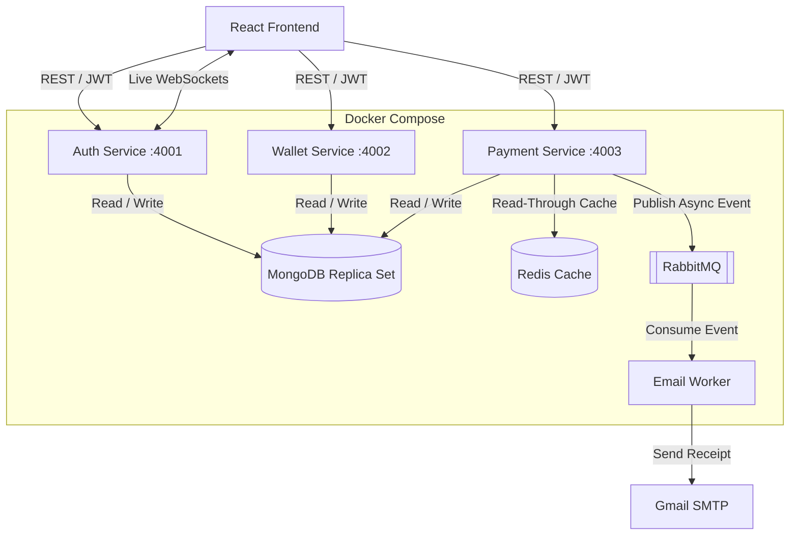

# NovaPay

NovaPay is a containerized, event-driven fintech platform demonstrating a modern microservices architecture. It features secure peer-to-peer money transfers, real-time WebSockets, read-through caching, and asynchronous background processing.

## Architecture Diagram

Below is the high-level architecture of how the microservices communicate with the databases, caching layer, and message queues.



## Core Features

* **Secure Authentication:** JWT-based stateless auth mechanism with user profile management.
* **Multipart File Uploads:** Secure KYC document and avatar uploads using `multer`.
* **Event-Driven Emails:** Heavy SMTP email dispatching is decoupled from the main API thread using a **RabbitMQ** queue and a dedicated background worker to ensure lightning-fast API responses and fault tolerance.
* **High-Performance Caching:** The user transaction dashboard implements a read-through caching strategy via **Redis** with automated cache-invalidation on successful transfers, drastically reducing MongoDB read operations.
* **Real-Time Push Notifications:** The frontend maintains a persistent **WebSocket** connection to instantly reflect administrative KYC approvals and UI state changes without requiring page refreshes.
* **Wallet & Bank Integration:** Users can securely link external bank accounts to fund their digital wallets before executing peer-to-peer transfers.

## Local Setup & Installation

NovaPay is fully containerized. You do not need to install MongoDB, Redis, or RabbitMQ on your host machine.

### Prerequisites
- Docker & Docker Desktop
- Node.js (v18+)

### 1. Start the Backend Infrastructure
Navigate to the root directory and spin up the microservices using Docker Compose:
```bash
docker-compose up -d --build
```
*(This will start MongoDB, Redis, RabbitMQ, the Auth Service, Wallet Service, and Payment Service on their respective ports).*

### 2. Start the Frontend
Open a new terminal window and navigate to the React app:
```bash
cd apps/web
npm install
npm run dev
```

The application will now be running on `http://localhost:5173`.

## Microservices Breakdown

| Service | Port | Responsibility |
|---|---|---|
| `auth-service` | 4001 | JWT issuance, Profile management, WebSockets, File Uploads |
| `wallet-service` | 4002 | Balance ledger, Bank account linking, Top-ups |
| `payment-service` | 4003 | P2P Transfers, Redis Caching, RabbitMQ Message Publishing |
| `emailWorker` | - | Background Node script consuming RabbitMQ events to send SMTP emails |

## Future Roadmap (Enterprise Scalability)
- [ ] Migrate codebase to strictly typed **TypeScript**.
- [ ] Implement the **Transactional Outbox Pattern** to mathematically guarantee no money is lost during the "Dual Write" phase between MongoDB and RabbitMQ.
- [ ] Transition file uploads from local disk to **AWS S3**.
- [ ] Implement automated unit testing coverage via **Jest**.
